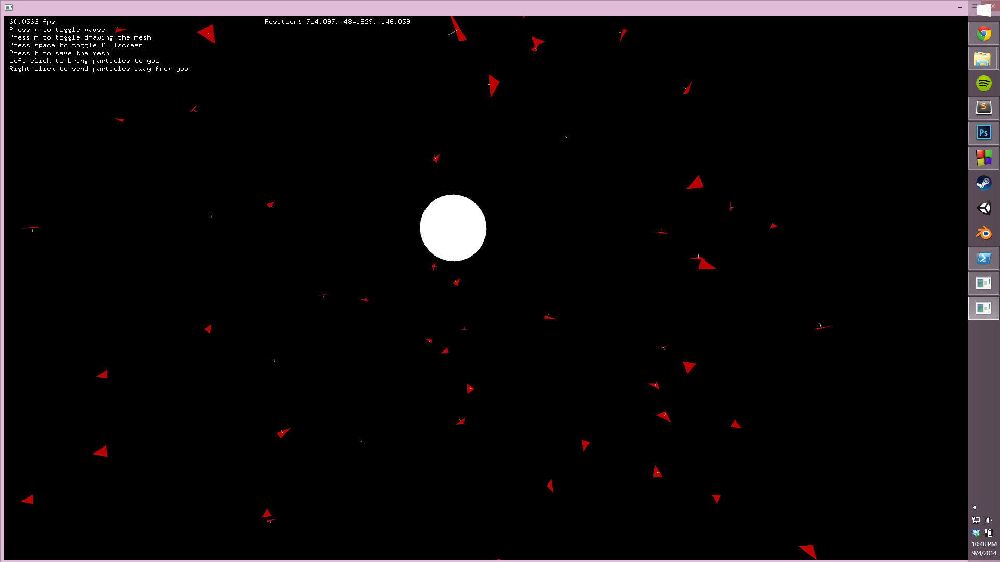
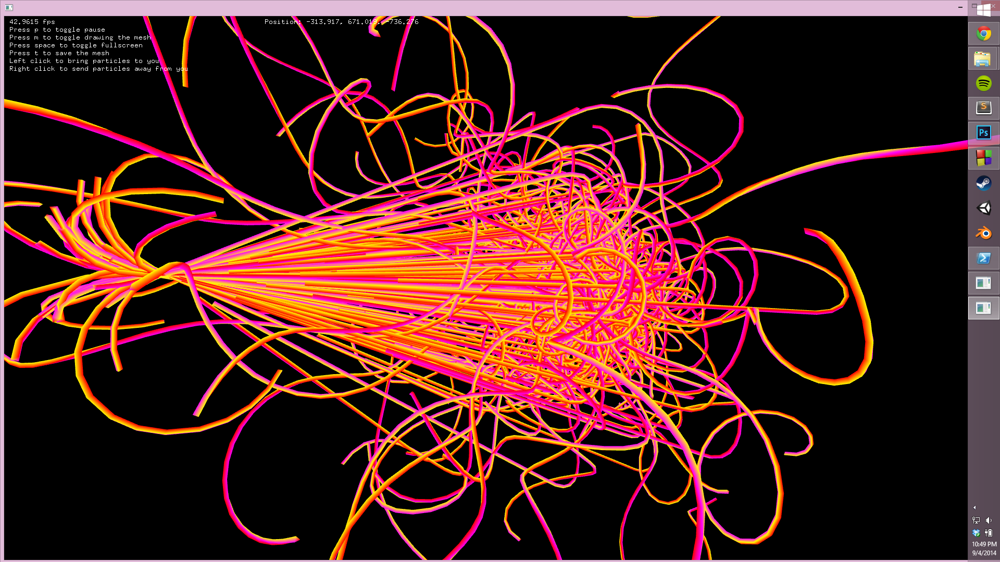
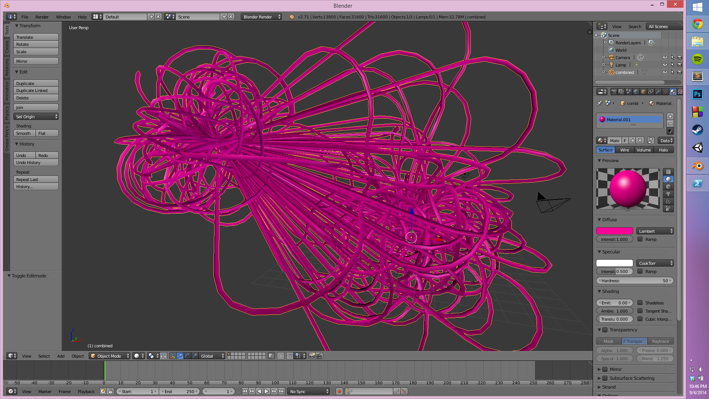

meshyParticles
==============

An openFrameworks project to create a mesh from a particle system.

The particles were triangles that flew around in 3D space.

When the particles die, they leave behind a mesh that contains the path they took when they lived.

A mesh representing the whole particle system can be exported and opened up in 3D modeling software, like blender:

The goal was eventually to 3D print the mesh that comes out of the particle system.